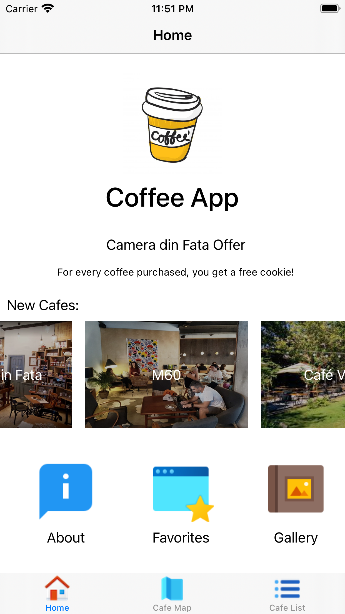
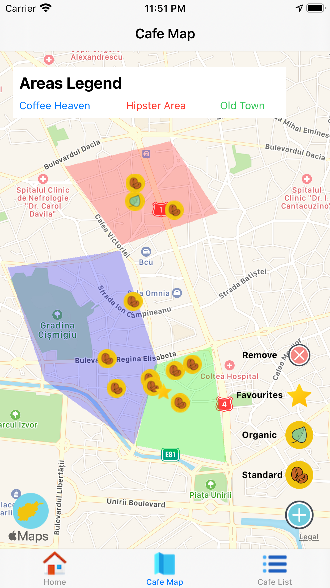
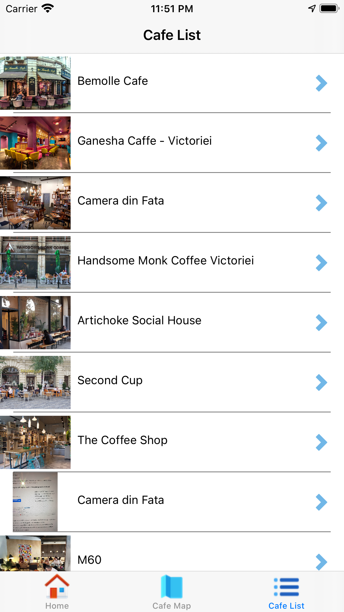
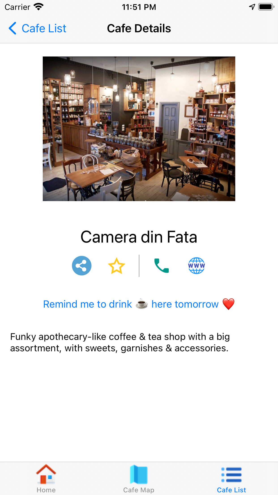

# MultipurposeSwiftCoffeeApp
An iOS Swift app that showcases many features. 

 
 

# Important  
As you can see in the pictures, this is a very basic app in terms of UX. Nevertheless, in order to solidify my knowledge in developing iOS apps and play with stuff I have rarely used before, I created this project in order to present it further to my teacher at the Univeristy of Bucharest. Please bear in mind that the app uses the MVVM pattern. It is not perfect nor completed. I have worked on more complex apps using Routers, Presenters and Coordinators. This app simply stores an AppContext in the AppConfiguration (where we put most of our config vars) for easy access.

# What to do before?

Download `GoogleService-Info.plist` from Firebase and then uncomment the specific lines in AppDelegate.  
You need to have cocoapods installed and you must run *pod install* in terminal in the project directory. Then open the workspace of the app.  

## What does the app do?

It is an app that helps you discover *coffee places* in Bucharest, Romania. It has a list of coffee shops, a map where you can sort coffee shops by category or region and a home screen where you can see news, new coffee shops and see your favourites. 

## Things you can find in the app:

* use of Realm database both for storing the latest Firebase data and for marking favourites
* web services: I used Firebase to fetch the coffee shops. You must create your own Firebase app, add the cafes.json to your app Realtime Database, set your own rules and so on. I have managed to upload a json file directly and use it as a fallback in case Firebase is not configured, so you can still check out the app. 
* UPDATE: THIS HAS BEEN REMOVED web services 2: I use NSURLConnection to fetch for a specific JSON file in order to show "news" about coffee places. NSURLConnection is deprecated but this was the course requirement. Bear in mind you can use many other alternatives such as the new NSURLSession.
* import images from the image gallery
* video playback using AVFoundation and AVKit
* implementation of a custom UICollectionView and UITableView
* implemented a few types of navigation across the app: NavigationController and UITabBarController for example
* implemented sharing using UIActivityViewController
* implemented Local Notifications (reminders)
* implemtend Apple Maps using MapKit along with overlays and pins
* implemented animations using CABasicAnimation (the mug in the home screen is moving) and CAKeyframeAnimation (the categories button on the map view expands)
* integrated web views using WKWebView
